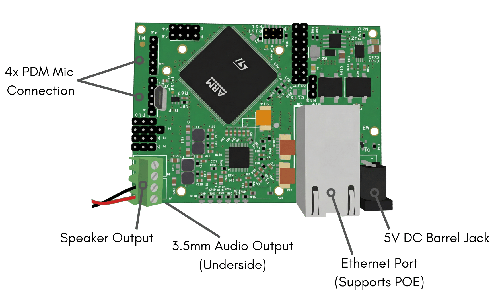
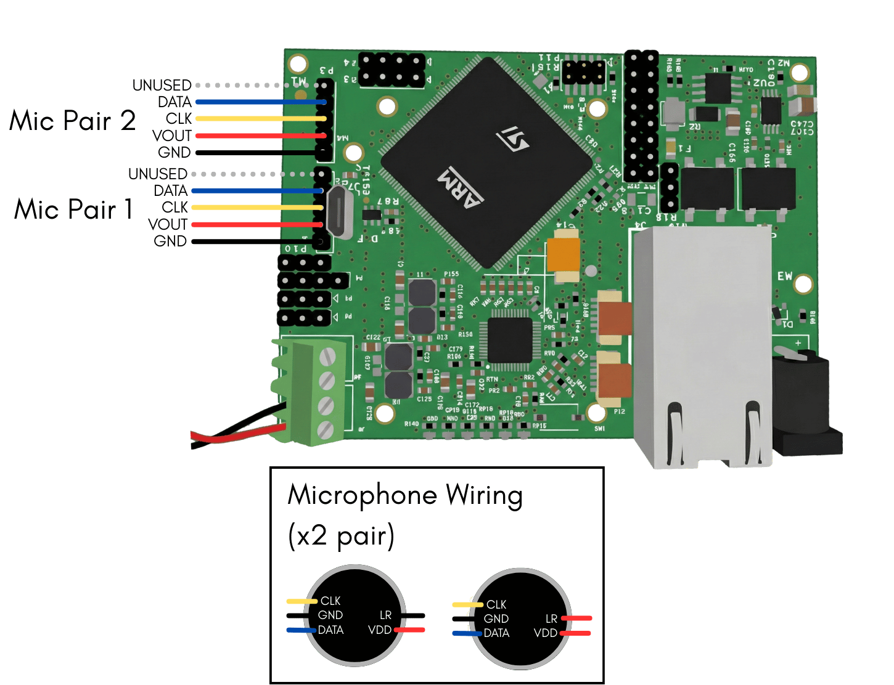

# Setting Up the Rero Board

The Reverb Robotics Single Board Computer is based on the raspberry pi compute module and comes preinstalled with Rero Core. The board requires only the connection of power, microphones, and networking before it is ready to use. 

## Hardware Overview
The Rero Board comes equipped with a connection for up to 4 PDM MEMS microphones, a connector for stereo speaker output (up to 10 watts), a 3.5mm audio output jack, and ethernet (including Power-over-Ethernet support). The details are outlined in the illustration below. 

It is important to only use a 5V/4A power supply when using the barrel jack connector, in order to not damage the board. Additionally, if mounting the board and/or microphones against metal or conductive parts, ensure a layer of insulation between any exposed pins/vias/etc to prevent shorts and electrical damage. 

## Microphone Wiring
PDM MEMS microphones are wired to the two sets of header pins located on the left side of the board, as shown in the following diagram. Two microphones are wired to each connector, with the L/R pin set to low for the left mic and high for the right mic of each pair. 

Ensure the microphones are wired correctly before powering up the board to ensure the board is not damaged.

## Configuring Networking and Logging into the Board

