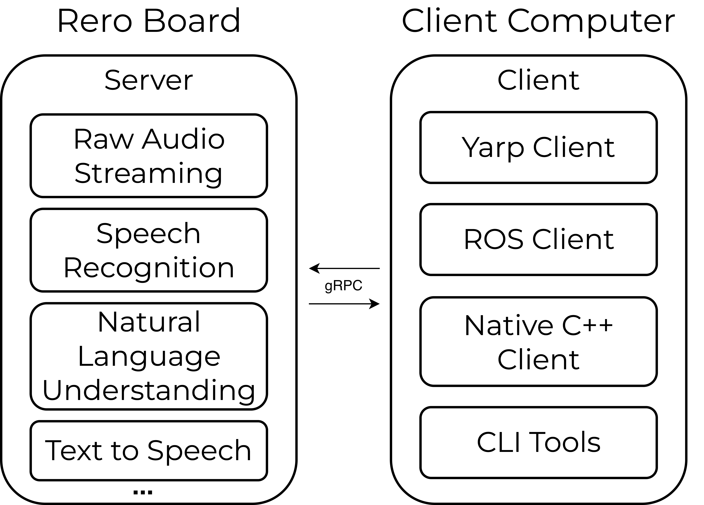

# Rero Core

Rero Core is an end-to-end platform for human–robot speech interaction, providing:

- Online speech recognition
- Natural language understanding (NLU)
- Text-to-speech (TTS)
- Audio streaming and diagnostics

The **Rero ROS / ROS2** packages wrap this functionality in ROS nodes and services so you can integrate speech into robotic systems with minimal boilerplate.

---

## What this documentation covers

1. **Getting Started** – prerequisites, supported platforms, and the quickest way to get a system running.  
2. **Installing Rero Core** – using prebuilt distributables or building from source.   
3. **Configuration** – configuring audio devices, models, vocabularies, and NLU. 
4. **Running the CLI Tools** – CLI utilities for speech recognition, NLU, TTS, and audio playback.  
5. **ROS Integration** – how to launch speech, NLU, TTS, DOA, VAD, and audio streaming nodes in ROS1 and ROS2.   

---

## Quickstart (10,000-foot view)

1. **Install system dependencies** (ALSA, PortAudio, C++ toolchain, CMake, git, etc.).   
2. **Install Rero Core** using either:
   - a **prebuilt distributable** (Ubuntu/Raspbian executables or pi image), or  
   - a Reverb Robotics single-board computer with Rero Core preinstalled
3. **Start the `rero_server`** with your `config.ini`, or make sure system service is running on Rero Board. 
4. **Test locally** with the CLI tools (speech recognition, NLU, TTS, audio player). 
5. **Build and launch Rero ROS / ROS2** nodes (`roslaunch` / `ros2 launch`) to integrate with your robot.   

Jump to **[Getting Started](./docs/getting-started)** to dive in.

## System Overview
An overview of the Rero Core software architecture is illustrated below. The Rero Core server runs on the Rero Single Board Computer, and clients connect to the server over the network using gRPC. CLI tools for debugging, ROS and YARP clients, and a C++ client library are also provided. 

{: width="60%" }